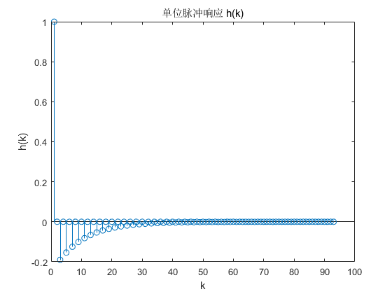
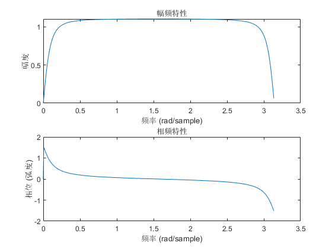

① 确定系统函数


② 求单位序列响应 


```matlab
% 定义差分方程的系数
b = [1, 0, -1]; % 分子系数
a = [1, 0, -0.81]; % 分母系数

% 计算单位脉冲响应
h = impz(b, a);

% 绘制单位脉冲响应
stem(h);
title('单位脉冲响应 h(k)');
xlabel('k');
ylabel('h(k)');

```

    
    


    

    


③ 绘出频率响应函数 


```matlab
% 计算频率响应
[H, w] = freqz(b, a);

% 绘制幅频特性
subplot(2, 1, 1);
plot(w, abs(H));
title('幅频特性');
xlabel('频率 (rad/sample)');
ylabel('幅度');

% 绘制相频特性
subplot(2, 1, 2);
plot(w, angle(H));
title('相频特性');
xlabel('频率 (rad/sample)');
ylabel('相位 (弧度)');

```

    
    


    

    


